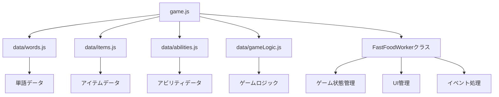

# ファストフードタイピングゲーム

タイピングゲームとローグライク要素を組み合わせた、ファストフード店員を題材にしたゲームです。

## 概要

プレイヤーはファストフード店の店員となり、お客様の注文をタイピングで処理していきます。正しくタイピングすることで注文を完了させ、スコアを獲得できます。レベルアップすると新しいメニューやアビリティが解放され、ゲームがより複雑になっていきます。

## 主な機能

- タイピングによる注文処理
- レベルアップシステム
- ショップシステム（アイテムとアビリティの購入）
- 時間帯による難易度変化（ランチタイム）
- 迷惑客の出現
- 新メニューの解放
- スコアとコインの管理

## システム構成

## ゲームの流れ

1. ゲーム開始
   - レベル1からスタート
   - 基本的なメニューのみ利用可能

2. ゲームプレイ
   - 画面右部から注文が流れてくる
   - 正しくタイピングして注文を処理
   - 時間内に処理できないとHPが減少

3. レベルアップ
   - 目標スコア達成でレベルアップ
   - ショップでアイテムやアビリティを購入可能

4. ショップ
   - アイテム：一時的な効果
   - アビリティ：永続的な効果
   - 新メニュー：新しい注文の追加

## 特殊要素

### ランチタイム

- 11:00-14:00の間
- 敵の移動速度が1.3倍
- 制限時間が0.7倍
- 最大敵数が+2

### 迷惑客

- 10%の確率で出現
- 処理に失敗した場合のダメージが2倍

### アビリティ

#### レアアビリティ

- スマートレジ（100コイン）：同じ商品の客を一斉に処理
- タイムセーバー（120コイン）：全ての注文の制限時間が10%延長
- クイックハンド（120コイン）：タイピング速度が10%上昇
- ダブルオーダー（140コイン）：ランダムで一部の注文が2倍スコア

#### エピックアビリティ

- チップティップ（150コイン）：残り時間に応じてボーナスコイン獲得
- ランチマスター（180コイン）：ランチタイム中の難易度上昇を軽減

### アイテム

#### 基本アイテム

- 体力回復（50コイン）：HPを30回復
- タイムプラス（60コイン）：制限時間を2秒延長

#### 特殊アイテム

- 迷惑客バリア（100コイン）：迷惑客の出現を60秒間防ぐ
- コインボーナス（120コイン）：獲得コインが30秒間2倍
- スーパーフィンガー（200コイン）：10秒間、全てのタイピングが自動成功

#### 新メニューアイテム

- チーズケーキ（150コイン）：中級メニュー追加
- シェイク（150コイン）：中級メニュー追加
- フライドチキン（200コイン）：上級メニュー追加
- ビッグバーガー（200コイン）：上級メニュー追加
- マルゲリータピザ（180コイン）：上級メニュー追加
- カルボナーラ（180コイン）：上級メニュー追加

## 開発環境

- JavaScript (ES6+)
- HTML5
- CSS3

## 今後の開発予定

- イベントシステムの実装
- 連続正解ボーナスの追加
- スコア→コイン変換システムの改善
- 新規アビリティの追加
- 新規アイテムの追加
